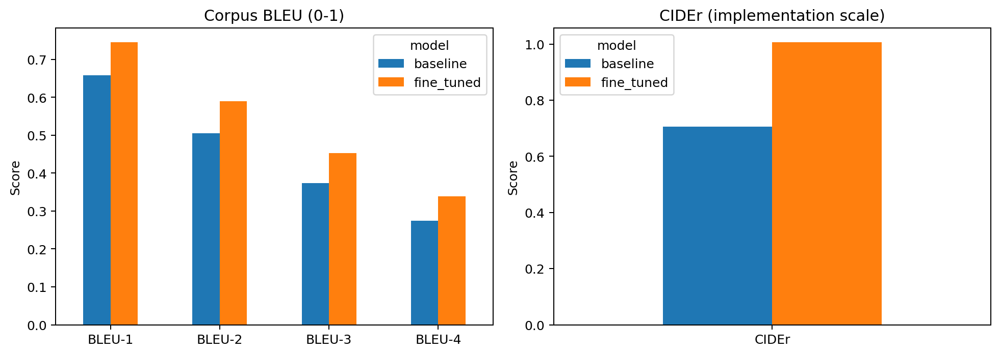
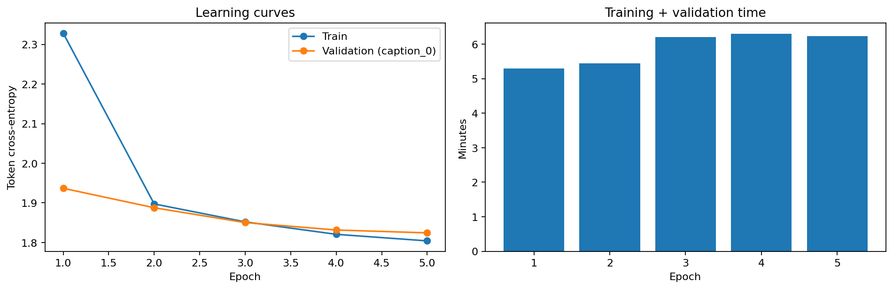

# Image Captioning with Vision-Language Models

Fine-tuning BLIP on Flickr8k for English image captioning. The experiment compares the pretrained checkpoint with a model whose text decoder has been fine-tuned while the visual encoder remains frozen.

## Results

Both checkpoints were evaluated on **1,000 test images**, with five reference captions per image and identical generation settings.

| Model | BLEU-1 | BLEU-2 | BLEU-3 | BLEU-4 | CIDEr | Seconds / image |
|---|---:|---:|---:|---:|---:|---:|
| Pretrained BLIP | 0.6586 | 0.5047 | 0.3736 | 0.2741 | 0.7066 | 0.1504 |
| Fine-tuned BLIP | 0.7454 | 0.5896 | 0.4529 | 0.3387 | 1.0064 | 0.1510 |

Fine-tuning increased BLEU-4 by 0.0646 and CIDEr by 0.2998 on this test split. The selected checkpoint is from epoch **5**, with validation loss **1.8244**.





[View caption examples](results/random_caption_examples.png) · [Open the saved-results notebook](notebooks/results.ipynb) · [Download the comparison CSV](results/caption_comparison.csv)

## Method

- **Dataset:** Flickr8k, using the `intro/flickr8k` distribution: 6,000 training, 1,000 validation, and 1,000 test images. Data is downloaded as four Parquet files.
- **Model:** `Salesforce/blip-image-captioning-base`, with 247,414,076 parameters; 161,323,580 parameters were trainable.
- **Training:** 5 epochs, batch size 4, gradient accumulation 4 (nominal effective batch size 16), AdamW, learning rate 2e-05, weight decay 0.01, and mixed precision.
- **Caption sampling:** one reference per image per epoch, cycling through all five references over five epochs.
- **Checkpoint selection:** lowest validation loss, measured consistently using `caption_0`.
- **Generation:** beam search with 3 beams and at most 40 new tokens; no sampling.

The recorded run used a **Tesla T4**. Training plus validation took approximately **29.5 minutes** across all epochs; peak allocated GPU memory was **3.46 GiB**. These measurements exclude model loading, data preparation, and checkpoint writes.

## Repository contents

| Path | Contents |
|---|---|
| `notebooks/train_blip.ipynb` | Colab training and evaluation pipeline |
| `notebooks/results.ipynb` | Executed review of saved metrics, curves, and example predictions |
| `scripts/infer.py` | Caption generation from a downloaded checkpoint |
| `scripts/summarize_results.py` | Summary of the recorded experiment |
| `results/` | Original CSV, JSON, figures, split records, and review images |
| `config.json` | Configuration of the recorded run |
| `best_checkpoint_selection.json` | Selected epoch and validation loss |
| `models/README.md` | Checkpoint download instructions |
| `requirements.txt` | Project dependencies |

## Run in Colab

1. Open `notebooks/train_blip.ipynb` in Google Colab.
2. Select a GPU runtime and run the cells in order.
3. Connect Google Drive and provide a Hugging Face read token when prompted. Token input is hidden; do not paste a token into notebook source.
4. Use the same run name and configuration to resume an existing run. Use a new run name for a different experiment.

The training notebook contains the pipeline source. Its original Colab execution outputs were not present in the shared folder. The separate results notebook was executed from the exported artifacts; it does not rerun training or infer new test captions.

## Local inference

Install the dependencies in a Python environment with a compatible PyTorch build:

```bash
pip install -r requirements.txt
```

Download the complete [selected checkpoint folder](https://drive.google.com/drive/folders/178szo47NNO2jFe5UiGKgDSyiUOwgaijO) into `models/best_model/`. Keep its configuration, tokenizer, processor, and weight files together. Then run:

```bash
python scripts/infer.py --model models/best_model --image path/to/image.jpg
```

CPU inference is supported. GPU inference uses mixed precision by default. The checkpoint weights and the training state are excluded from Git. The [original experiment folder](https://drive.google.com/drive/folders/1_noO0uJgj5UW8ZNNh_skjXlfKNLBTEPQ) contains those files.

To inspect the recorded scores without downloading a model:

```bash
python scripts/summarize_results.py
```

## Evaluation notes

BLEU is corpus-level and unsmoothed. BLEU and CIDEr use the same lowercase English word tokenizer, retaining apostrophes inside words and excluding punctuation. This differs from COCO's PTB preprocessing; these scores should be compared only with experiments using the same metric setup. CIDEr is reported on the native scale of `pycocoevalcap.cider.Cider`, not as a percentage or as CIDEr-D.

The timing column measures batch throughput after warm-up, including preprocessing, generation, and decoding. It excludes dataset access and metric computation.

The split audit checks exact RGB-pixel duplicates across Flickr8k splits. It does not verify near-duplicates or overlap with pretraining data. Manual-review forms are included, but their scoring fields are blank; no human-evaluation result is claimed.

## References

- Li et al. (2022), [BLIP: Bootstrapping Language-Image Pre-training for Unified Vision-Language Understanding and Generation](https://arxiv.org/abs/2201.12086).
- [BLIP checkpoint and model card](https://huggingface.co/Salesforce/blip-image-captioning-base).
- [Flickr8k distribution](https://huggingface.co/datasets/intro/flickr8k).
- [Caption evaluation implementation](https://github.com/salaniz/pycocoevalcap).
